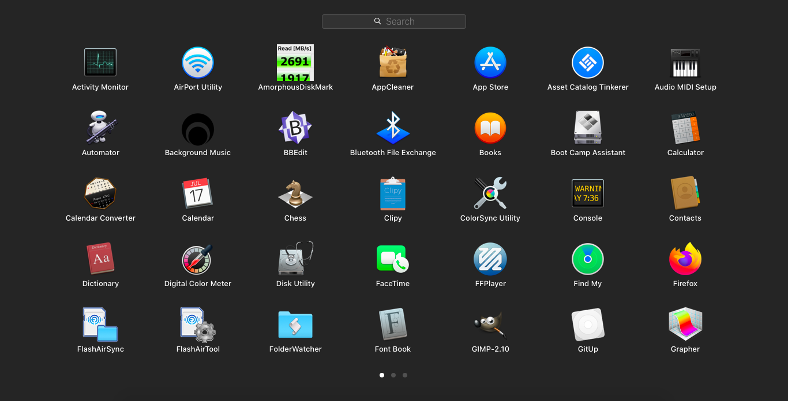

# launchpad-scripts

Shell scripts to control Launchpad for macOS Catalina 10.15.4

- launchpaddump.sh (print raw database contents)
- launchpadreset.sh (reset to default order)
- launchpadsort.sh (sort to alphabetical order, no groups, like bellow↓)

